# **Art Gallery Mazeki**

Art Gallery Mazeki is an online artist gallery website where the artist is introducing herself and her artwork to the wider audience. 
The user is able to navigate through the website to see the artwork.
The website gives the user a list of upcoming exhibition events for them to attend.
The user is also able to subscribe to receive future exhibition events schedule dates so they do not miss them.
In addition, a question can be send to the artist for her to answer.

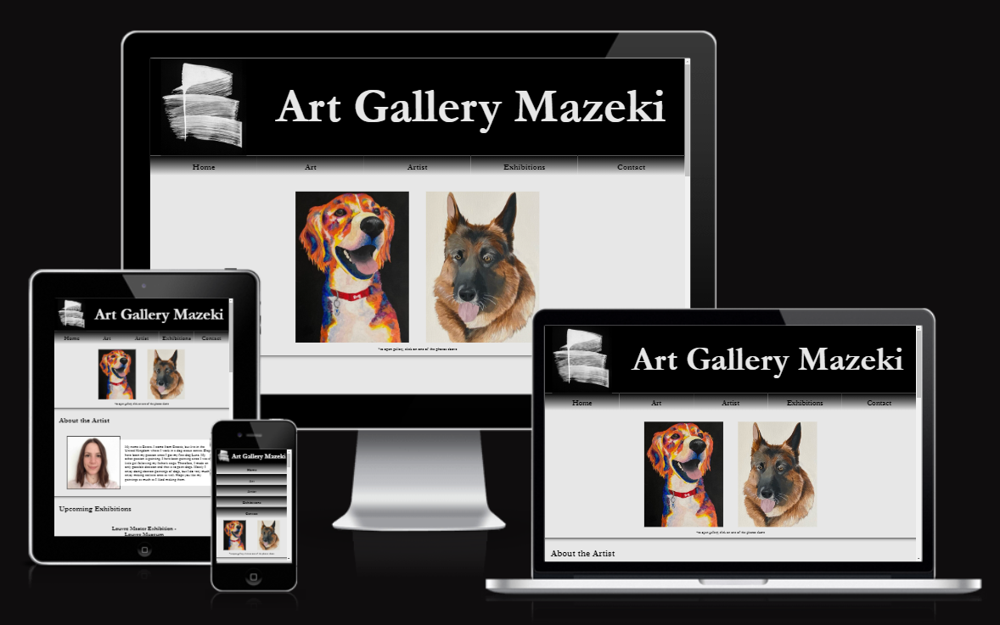

## **Feature**
* ### **The header**
    * Featured at the top of the page, the header shows the logo of the art gallery and the name of the art gallery
    * This section clearly tells the user to expect this webpage to be an art gallery

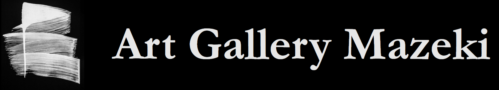

* ### **Navigation bar**
    * Navigation links are positioned bellow the header: Home, Art, Artist, Exhibitions, Contact which link to the different sections of the same webpage
    * Links are in gradient background going from black through grey to whitish and in black color that reverses on hover making it clear where the cursor is

* ### **Art**
    * Art section of the webpage gives an option to the user to choose to enter either realistic art gallery or abstract art gallery
    * Upon hovering over the photos in this section, photos get covered with transparent grey background sliding from bottom to top and name of the gallery they would enter upon clicking

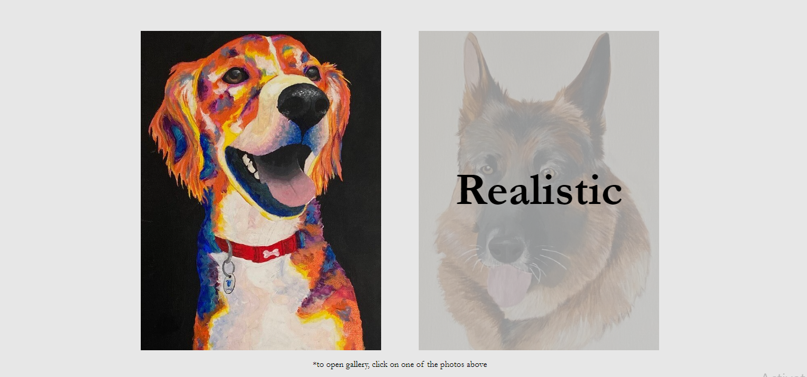

* ### **About the Artist**
    * In about the artist section, user can see the photo of the artist and a brief description of her

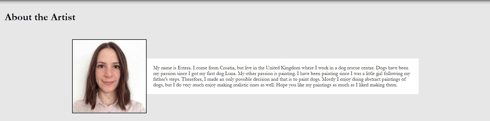

* ### **Upcoming Exhibitions**
    * In “Upcoming exhibition” section user is presented with three exhibition events that they can attend
    * Each exhibition has its own name, photo of the location and the brief description of what they can expect if decide to attend
    * Description text is hidden, but can be expanded upon clicking on <button>More/Less</button> located on the top right corner of each exhibition location photo

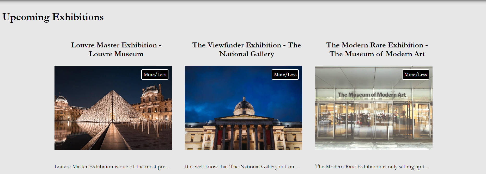

* ### **Contact**
    * In “Contact” section there is a form that the user can complete to subscribe for receiving dates for future exhibition events and/or ask the artist a question
    * When submitting the form, user redirected to the “Thank you” page
    * Underneath the form, user can see the address of the Art Gallery and location on the map

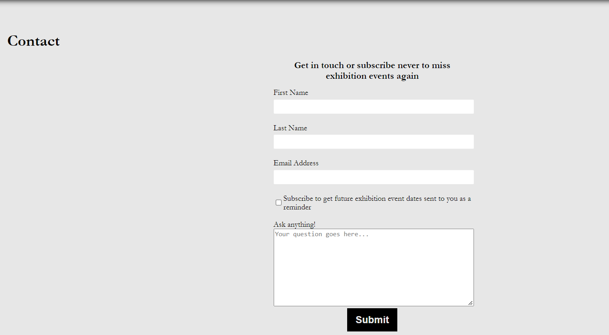
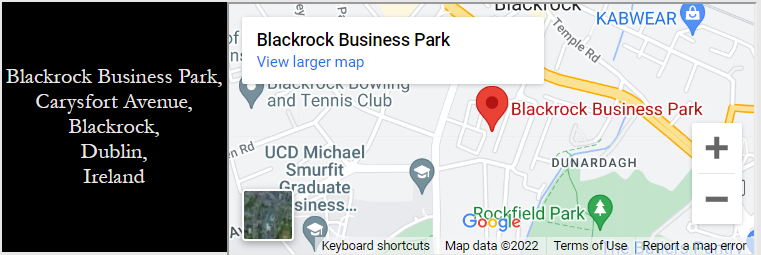

* ### **Footer**
    * Footer section, located at the bottom of the page, gives the user access to the gallery’s social media pages: youtube, pinterest, Instagram, twitter and facebook
    * It is shown in footer that the artist (or the Art Gallery Mazeki) holds the copyright to the photos on the website

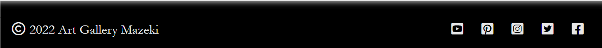

## **Testing**
* I tested the website in three different browser: Chrome, Firefox and Safari – there is an bug in Firefox browser to which I refer in “Bugs” section of this document
* I can confirm that all the text in any of the sections (header, navigation bar, art, about the artist, exhibitions, contact and footer) is readable and easy to understand
* I have confirmed that the form is working: entries for first and last name are required and email input only accepts emails; checkbox and textbox are optional
* Using dev tools, I can confirm that the website is responsive to all standard width sizes

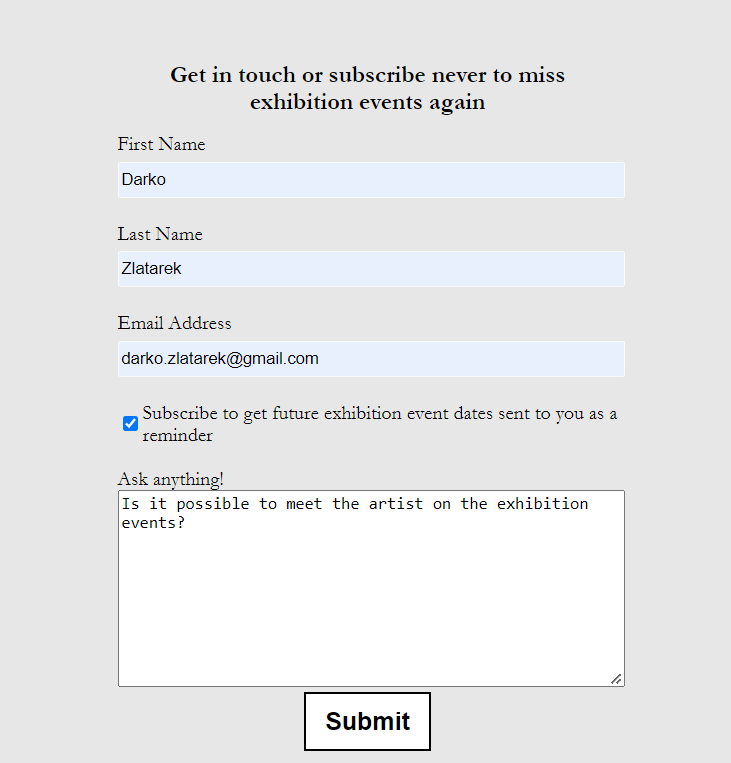 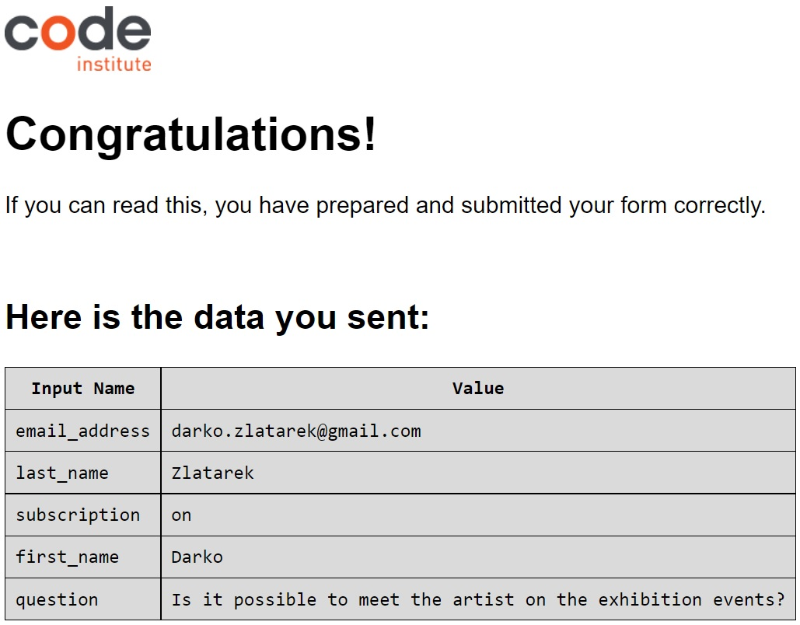

## **Bugs**

* In Art section I had difficulty with the .slide, it started the transition few pixels below the photos – *eventually found the issue and adjusted the padding for it*

* Social media icons in the footer did not stay in line when reducing the screen size - *this was fixed with “flex-direction: row-reverse“ *

* Form, upon submitting was not opening the “Thank you” page but throwing Error 501 message instead - *had to change method attribute from POST to GET*

* **Existing bug in Firefox browser** - *in exhibitions section, apart from the checkbox at the top right corner of the photos, there is another small checkbox below the photos (this is only the case in Firefox browser)*

## **Validator testing**
* HTML
    * When submitting the HTML code of the index.html, abstract.html, realistic.html and thankyou.html to the official W3C validator, no errors were returned
    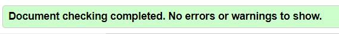
* CSS
    * When submitting the CSS code to the official (jigsaw) validator, no errors were returned
    
* Accessibility
    * I can confirm that the website is accessible by running it through lighthouse in devtools
    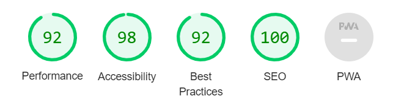

## **Deployment**
* The website was deployed to the GitHub pages. The steps were:
    * In the GitHub repository, I clicked on the settings button
    * Then navigated to the Pages section
    * There, under "Branch" in dropdown selected "main"
    * The page then refreshed and provided the link to the completed website

## **Content**
* CSS code for transition in "Art" section taken from the [W3CSchools](https://www.w3schools.com/css/tryit.asp?filename=trycss_css_image_overlay_slidetop)
* CSS code for <button>More/Less</button> in Exhibitions section from [Stack Overflow](https://stackoverflow.com/questions/59100312/single-button-to-show-hide-element-with-pure-css) community where someone already asked the question on how to write that code

## **Media**
* The logo image in the header was taken from [Unsplash](https://unsplash.com/photos/nazeUct7aPs)
* Photos in the Exhibitions section was also taken from [Unsplash](https://unsplash.com/)